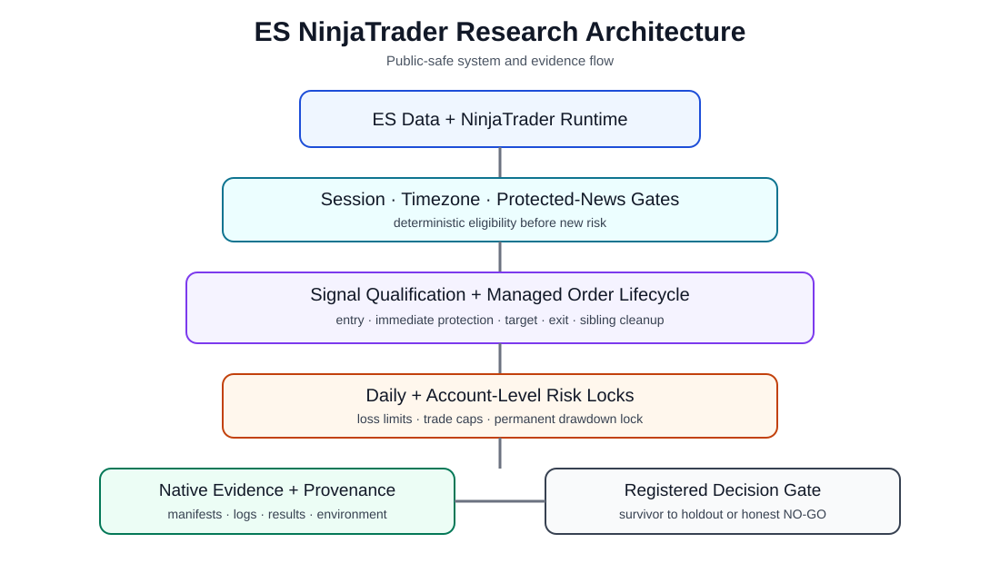

# ES Futures NinjaTrader Strategy — Engineering Case Study

> **OSYSTIC ENGINEERING CASE STUDY · PUBLIC SHOWCASE · SANITIZED · PORTFOLIO-SAFE**
>
> This repository contains **no client identity, no confidential NinjaScript source, no private market data, no raw trading exports, no account details, no credentials, no commercial terms, and no private conversations**.



## Company showcase classification

| Attribute | Public classification |
|---|---|
| Publisher | **OSYSTIC** |
| Artifact type | Engineering case study / capability proof |
| Platform | NinjaTrader 8 / NinjaScript |
| Market | ES futures |
| Source engagement | Completed client engineering and research engagement |
| Publication model | Sanitized public showcase with independent Git history |
| Confidential implementation | Excluded and retained privately |
| Live/funded trading claim | None |
| Intended use | Portfolio, proposals, technical due diligence, capability review |

## What this repository is

An anonymized case study of a multi-phase ES futures strategy engagement. The work combined NinjaTrader strategy engineering, managed-order safety, Eastern Time session controls, protected-news handling, account-level risk locks, multi-year backtesting, execution-cost stress, pre-registered parameter robustness testing, evidence validation and an honest promotion decision.

The project demonstrates an important research principle: completing a trading system responsibly does not require declaring a weak result successful. The final delivery preserved a technically functional strategy and a controlled SIM-evaluation candidate while refusing to market historical evidence as live-ready profitability.

## Engagement outcome

The three-phase engagement was completed and accepted.

- The NinjaTrader strategy architecture and safety controls were delivered.
- The registered Phase 3 matrix completed **44/44 native NinjaTrader runs** across 11 one-factor candidates and four fixed windows.
- **0/11 candidates** satisfied every pre-registered robustness gate.
- Additional bounded strategy-family research expanded the investigation to more than 115 candidate configurations without finding an evidence-supported live/funded candidate.
- The closest candidate, `STOP_L`, was delivered for **research / paper-trading only** with frozen parameters.
- Live or funded-account promotion remained **NO-GO**.
- Stage B was not opened because the registered protocol produced no eligible survivor.

This is a completed engineering and research outcome, not a profitability guarantee.

## Public vs. private repository boundary

| Area | This public showcase | Confidential delivery repository |
|---|---|---|
| Visibility | **Public** | **Private** |
| Purpose | Portfolio, proposals, capability proof | Engineering source of truth |
| NinjaScript source | **Not included** | Controlled/private |
| Native NT8 exports and screenshots | **Not included** | Controlled/private |
| Market/news datasets | **Not included** | Controlled/private/licensed |
| Client identity or conversations | **Not included** | Controlled/private |
| Account, machine or provider identifiers | **Not included** | Controlled/private |
| Commercial/payment information | **Not included** | Controlled/private |
| Aggregate validation findings | Included | Full evidence retained |
| Safe to share publicly | **Yes** | **No** |

This repository is not a fork, mirror or source-code export. It has an independent sanitized Git history.

## The engineering challenge

- Build a NinjaTrader-compatible ES strategy with conservative drawdown and execution-aware behavior.
- Keep immediate protective downside control active through the managed-order lifecycle.
- Enforce session, daily-risk, account-level drawdown and protected-news constraints.
- Test realistic commission/slippage assumptions without tuning them away.
- Separate development, historical validation, current-regime diagnostics and external holdout.
- Prevent parameter rescue after weak validation results.
- Preserve complete provenance for losing, zero-trade and globally locked runs.
- Deliver a useful client handover without making unsupported live-trading claims.

## Research and validation architecture

```text
ES market data / NinjaTrader environment
                 ↓
Session + timezone + protected-news controls
                 ↓
Signal qualification and managed-order lifecycle
                 ↓
Immediate stop / target / exit handling
                 ↓
Daily and account-level risk locks
                 ↓
Native runtime evidence and provenance
                 ↓
Pre-registered multi-window candidate matrix
                 ↓
Deterministic eligibility gate
          ↙                         ↘
  no eligible survivor       eligible survivor
  honest NO-GO close         untouched holdout
```

## Engineering highlights

- **Managed-order safety:** protective downside handling, target lifecycle and sibling cleanup were validated in NinjaTrader.
- **Time discipline:** application time was normalized to Eastern Time for session and protected-news behavior.
- **Fail-safe news controls:** required schedule provenance and defensive behavior were built into the runtime boundary.
- **Account survival controls:** daily limits, consecutive-loss controls, trade caps and a permanent internal drawdown lock constrained new risk.
- **Pre-registration:** candidates, windows, tags and decision gates were fixed before reviewing the final matrix.
- **One-factor robustness:** the primary neighbourhood changed one registered parameter at a time instead of running an unconstrained Cartesian optimizer.
- **Evidence-first workflow:** manifests, logs, summaries, trades, orders, executions, screenshots and environment provenance were audited together.
- **Honest rejection:** poor candidates were retained and classified rather than rescue-tuned after validation.
- **Prospective boundary:** the closest candidate was restricted to SIM observation with frozen parameters and a defined reassessment threshold.

## Public result summary

The closest registered candidate was positive only at the combined-validation margin and failed development/minimum-window robustness.

| Measure | Public aggregate |
|---|---:|
| Registered native Phase 3 runs | 44 / 44 |
| Registered candidates | 11 |
| Fully eligible candidates | 0 |
| Closest candidate validation net | +$46.56 |
| Closest candidate validation PF | 1.0075 |
| Closest candidate validation trades | 44 |
| Closest candidate average trade | +$1.06 |
| Closest candidate max drawdown | $1,312.38 |
| Closest candidate minimum window PF | 0.71 |
| Closest candidate development result | -$1,014.34 |

The evidence supported controlled prospective observation, not live/funded deployment.

## Technology

`NinjaTrader 8` · `NinjaScript / C#` · `ES futures` · `managed orders` · `multi-series strategy logic` · `CSV/JSON evidence` · `Python validation tooling` · `GitHub Actions`

## What is intentionally not claimed

This showcase does **not** claim:

- guaranteed profitability, profit factor, win rate, ROI or loss prevention;
- live or funded-account readiness;
- identical execution across brokers, feeds, contracts, merge policies or NinjaTrader builds;
- tick-accurate reproduction from bar-only data;
- that historical fills equal live order execution;
- that the public repository can reproduce the confidential strategy;
- redistribution rights for private or licensed market/news data;
- that a completed client delivery is equivalent to a passed trading model.

## Read more

- [Full case study](case-study.md)
- [Technical architecture](docs/technical-overview.md)
- [Validation methodology](docs/validation-methodology.md)
- [Public results summary](docs/results-summary.md)
- [Engineering lessons](docs/lessons-learned.md)
- [Disclosure boundary](docs/disclosure-boundary.md)
- [Publication and reuse notice](NOTICE.md)

## Disclosure boundary

Only sanitized architecture, methodology, aggregate results, limitations and engineering lessons are published. Confidential implementation source, raw evidence, private datasets, client information, account identifiers, commercial documents, delivery binaries and private repository history are intentionally excluded.

This is a **sanitized public showcase**, not the engineering source of truth.
